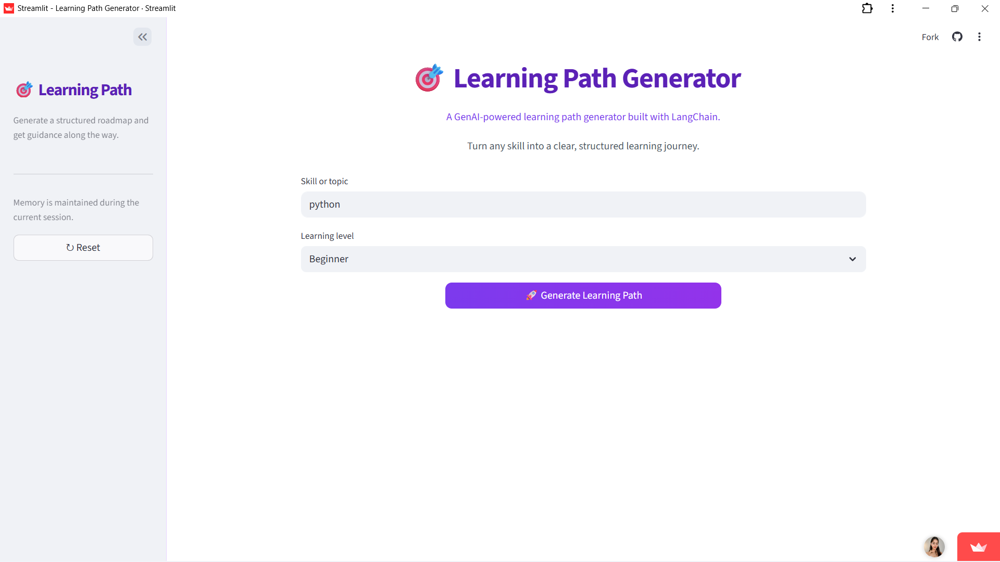
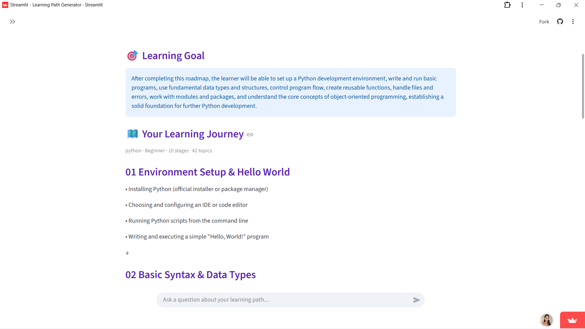
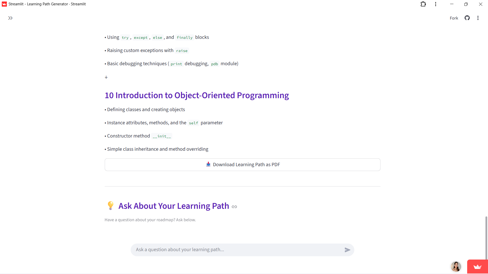

# 🎯 Learning Path Generator

An AI-powered application that generates a clear and structured learning roadmap for any skill or topic based on the learner's level.

The application is built using **Python, Streamlit, LangChain, and an LLM**.

## ✨ Features

- 🎯 Generate a structured learning path for any skill or topic
- 📊 Choose your learning level — Beginner, Intermediate, or Advanced
- 🗺️ Get a step-by-step roadmap with stages and topics
- 📄 Download the generated learning path as a PDF
- 💡 Ask follow-up questions about your generated learning path
- 🧠 Maintains conversation memory during the current session
- 🔄 Reset the current session whenever needed

## 🛠️ Technologies Used

- Python
- Streamlit
- LangChain
- LLM
- Pydantic
- ReportLab

## 📸 Application Preview

### Generate a Learning Path

Enter a skill or topic, select your learning level, and generate a structured roadmap.

### Generated Learning Path

The application generates a structured learning journey with a learning goal, stages, and topics.

### Download & Ask Questions

After generating the roadmap, you can download it as a PDF and ask follow-up questions about your learning path.

## ⚙️ Setup and Installation

### 1. Clone the Repository

    git clone <your-repository-url>
    cd <your-repository-name>

### 2. Create a Virtual Environment

    python -m venv .venv

Activate the virtual environment.

**Windows:**

    .venv\Scripts\activate

**macOS/Linux:**

    source .venv/bin/activate

### 3. Install Requirements

    python -m pip install -r requirements.txt

### 4. Configure Environment Variables

Create a `.env` file in the project directory and add your API key and model configuration.

Example:

    GROQ_API_KEY=your_groq_api_key
    MODEL_NAME=your_model_name
    MODEL_PROVIDER=groq

Replace the placeholder values with your own credentials.

## ▶️ Run the Application

Make sure the virtual environment is activated and your environment variables are configured.

    python -m streamlit run app.py

The application will open in your browser.

## 🔄 How It Works

    Enter Skill / Topic
            ↓
    Select Learning Level
            ↓
    Generate Learning Path
            ↓
    Structured Roadmap
            ↓
    Download as PDF
            ↓
    Ask Follow-up Questions

## 🚀 Live Demo

The application is deployed using Streamlit Cloud.

**Live App:** <https://learning-path-generator-app.streamlit.app>

## 👩‍💻 Author

**Mahek Bagai**

Built as a hands-on project to learn and apply **Generative AI, LangChain, and Streamlit**.
